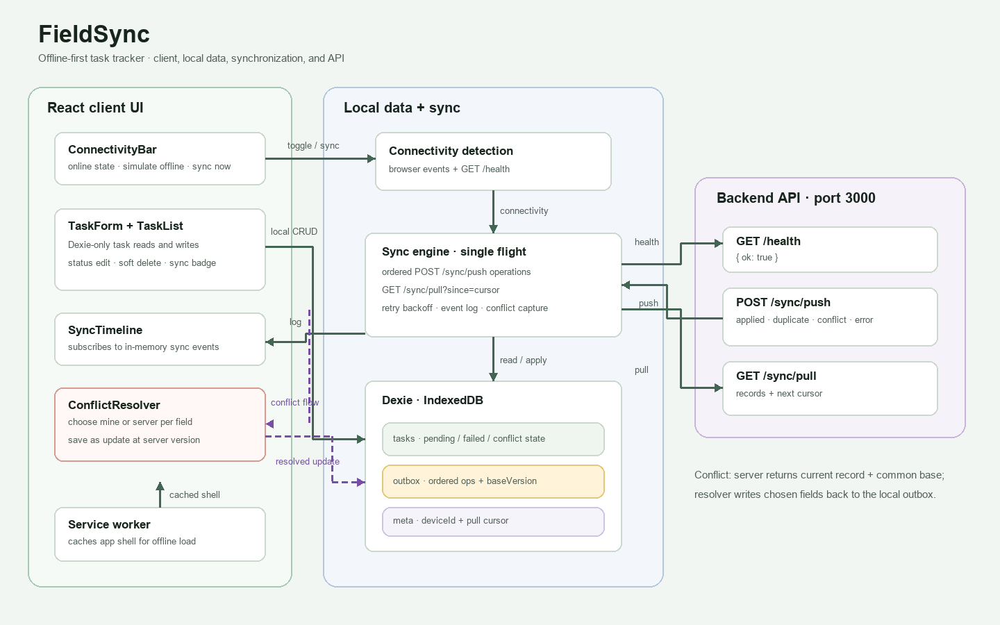

# FieldSync

FieldSync is an offline-first task tracker built for hackathon problem **ALG-WEB-02**. It keeps task work available in the browser when the connection drops and synchronizes queued changes with a backend when connectivity returns.

## Problem statement

Field workers and distributed teams need to create and update tasks in unreliable network conditions. FieldSync stores tasks locally first, preserves pending changes across reloads, and reconciles version conflicts when a server becomes reachable.

## Features

- Create tasks, change task status, and soft-delete tasks.
- Store task data and an ordered sync outbox in IndexedDB using Dexie.
- Show connectivity state, simulate offline mode, and manually retry sync.
- Push operations in order, pull server changes by cursor, and retry network failures with backoff.
- Resolve conflicts by choosing the local or server value for each differing field.
- Cache the built app shell with a PWA service worker.
- Run a local mock API on port 3000 for client demonstrations.

## Tech stack

React, Vite, JavaScript, Dexie, dexie-react-hooks, vite-plugin-pwa, plain CSS, and a Node built-in HTTP mock server. The client adds no UI or state-management libraries.

## Architecture



Editable vector: [docs/architecture.svg](docs/architecture.svg).

## Client setup

From the repository root:

```powershell
cd client
npm install
npm run dev
```

Open the local URL Vite prints, usually `http://localhost:5173/`. `npm install` is needed once after checkout. For a production build and service-worker preview:

```powershell
npm run build
npm run preview
```

## Backend setup

**TODO: Add the teammate's backend setup steps and real server launch command.** The client expects the API described in [docs/API.md](docs/API.md), available on port 3000 during development. Until the backend is running, the client correctly reports Offline. Do not implement the teammate-owned `server/` or `shared/` folders from this README.

For a temporary client demo, run the built-in-only mock instead. In a second terminal at the repository root:

```powershell
node tools/mock-server/server.js
```

Then run the client as above. The mock keeps data in memory and resets when stopped.

## Demo offline mode

1. Open FieldSync, then turn on **Simulate offline**.
2. Add a task, change its status, or delete it. The task stays in IndexedDB and shows Pending.
3. Refresh the page. The task remains because the browser database persists across reloads.
4. Turn **Simulate offline** off. With the mock or real backend running, the client checks `/health`, syncs automatically, and updates the task status.
5. For the offline app-shell check, load the production preview once, then use browser devtools to switch offline and reload.

## Demo sync and conflict resolution

For normal sync, start `node tools/mock-server/server.js` and the Vite client in separate terminals. Create or edit a task and the client syncs in the background after the local save. **Sync now** manually retries the health check and sync. The mock returns applied results and serves updates from its cursor-based pull endpoint.

To exercise the conflict resolver, start the mock before the client with one forced conflict armed:

```powershell
$env:MOCK_FORCE_CONFLICT = "1"
node tools/mock-server/server.js
```

Create a new task. The client immediately pushes it and the mock returns a server version and common base on the next pushed operation. Choose **Keep mine** or **Use theirs** for each differing field and save the resolution; the one-shot conflict has been consumed, so the resolving update syncs normally. **Sync now** remains available to trigger a manual retry.

**TODO: Add the hosted demo link.**  
**TODO: Add screenshots of the task list, offline state, and conflict resolver.**

## Folder structure

```text
hackathon/
├── client/                 # React/Vite offline-first frontend
│   ├── public/              # PWA manifest and icons
│   └── src/                 # App, Dexie database, sync engine, components, styles
├── docs/                    # Client API contract and architecture diagrams
├── tools/mock-server/       # Local Node mock API
├── server/                  # TODO: teammate-owned backend
├── shared/                  # TODO: teammate-owned shared contract/code
├── README.md
└── .gitignore
```

## Team roles

- **Client/frontend (Rahul):** React interface, IndexedDB persistence, sync behavior, PWA shell, and client documentation.
- **Server/shared (teammate):** Real API implementation and shared code. The teammate's server should follow [docs/API.md](docs/API.md).

## TODOs

- **TODO: Add real backend setup and launch instructions.**
- **TODO: Add the hosted demo link.**
- **TODO: Add screenshots.**
